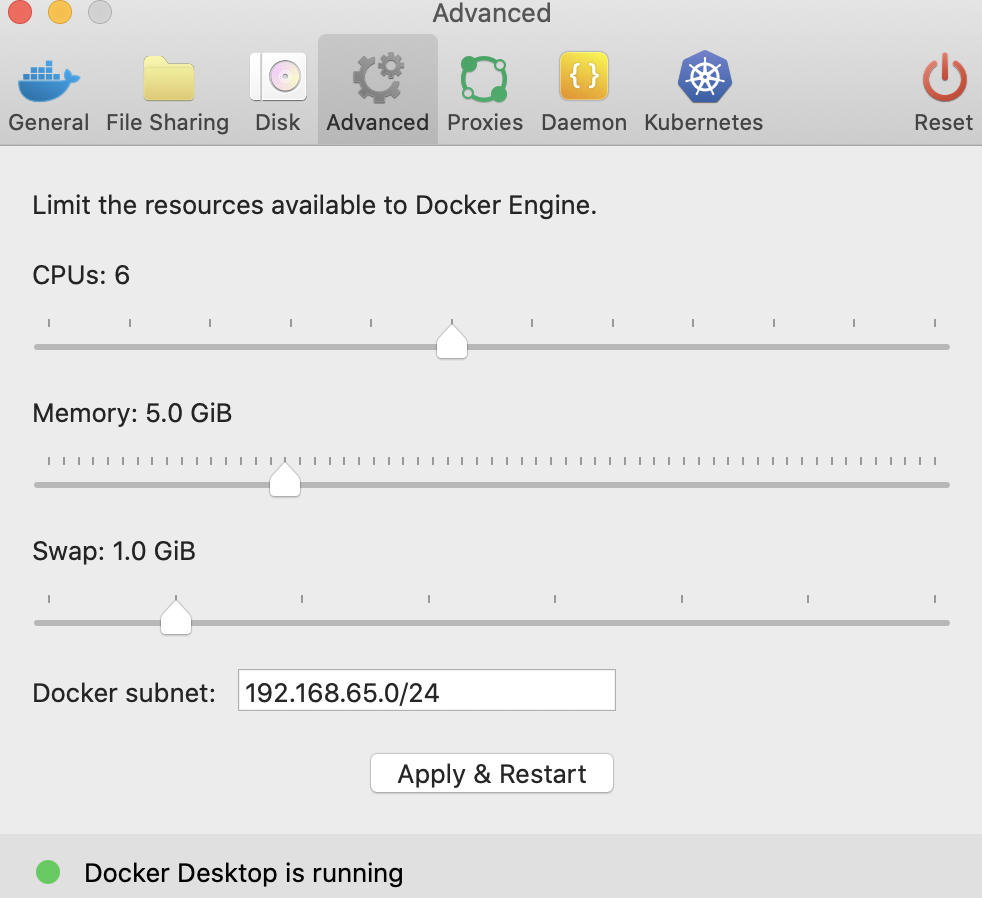
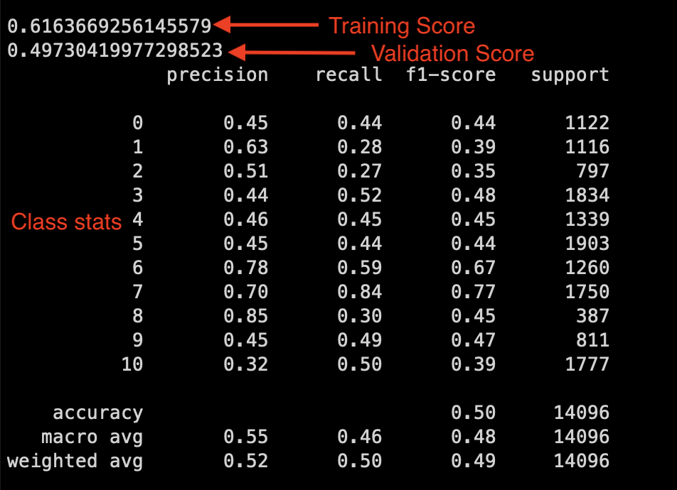

# Publication Prediction
## Summary
This project aims to predict the publication which published an article.  The classifier used is a naive Bayes classifier.  The framework used to create the REST API endpoint is Sinatra which is served via vanilla WEBrick.  The machine learning code is python-based and called from the Ruby webserver by invoking the python module.

## Project Structure
```
predict-publication/
|--.dockerignore	             # Ignore data dir during build
|--Dockerfile                    # docker build file
|--Gemfile						 # ruby gem dependencies
|--Gemfile.lock					 # fixed version of gems
|--REAMD.md						 # This file
|--app.rb						 # Sinatra web app
|--data/						 # Training data for the prediction model
|--images/					 	 # Images for the README.md
|--predict_publication.py		 # Python ML module for prediction
|--predpub.pkl					 # Trained model to be loaded for evaluation
```

## Usage
Docker is used to containerize the project and install the dependencies.

1. CD to the project directory

	`cd predict-publication`

2. Install git large file support for this repo

	`brew install git-lfs`
	
	`git lfs install --local`

2. Build the docker image

	`docker build -t predpub .`
	
3. Set your docker VM to use 5GB of memory
   This is necessary becase the model is a couple of GB
    becuase of the large vocabulary.  Can also try just increasing the swap.
   	
   

4. Run the image
 	
 	`docker run -d -p 8080:4567 --name predpub predpub:latest`

5. Hit the API

	__Request__:
	
	```
	curl -H "Content-Type: application/json" -X POST \
	--data '{"title": "Fake news explodes on the internet",
	"content": "article content goes here"}' \
	http://localhost:8080/predict_publication
	```
	__Response__:
	
	```
	{"publication":"Buzzfeed News"}
	```
	
## Analysis
### Possible improvements to design: 
The connection between the python and ruby code is brittle and a bit wasteful as a full python interpreter is brought up for every request.  Using a python webserver framework like Flask, Pyramid, or Django would be more efficient since the machine learning model would not have to be uncrompressed and loaded into a new interpreter for each request.  Another option would be to break the python ML code into it's own microservice, but a bit overkill for this project.  I used ruby for the webserver as that is the backend web tech with which I'm familiar.

### ML model:
A naive Bayes classifier was used to predict publication from title and content.  For the purpose of classification the title is considered to be part of the content and simple prefixed to the content.  80% of the csv data was used for training and 20% was used for test validation.  The classifier uses a bag of words vector to represent the content.  The uncompressed size of the CountVectorizer is about 2.2GB, so it has been compressed in the .pkl.  There are a total of 11 classes.
### Performance:
__11 Classes (0-10):__ ['Atlantic', 'Business Insider', 'Buzzfeed News', 'CNN', 'Guardian', 'NPR', 'New York Times', 'Reuters', 'Talking Points Memo', 'Vox', 'Washington Post']



The model predicts publication better than pure chance, but still leaves more to be desired.  Aggregating the bag of words across multiple authors and time periods of a publication, as this model does, likely muddles the signal of an author's style.  A better model could take into account more features of the article like the author, publication month, and year.  Naive bayes also assumes words are equally likely to appear next to one another which is not the case in reality.  Of course knowing the author of an article and knowing at what publication an author is employed makes this problem trivially easy to solve.  Barring that knowledge, having some representation within the model for higher level language constructs like phrases would be helpful.  A good next step would be to try a deep learning model.  A deep learning model might even have hidden layers that implictly represent a specific author's style and layers on top of that which reprsent the group of authors employed at a publication.